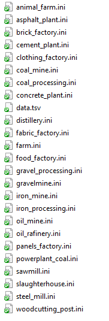
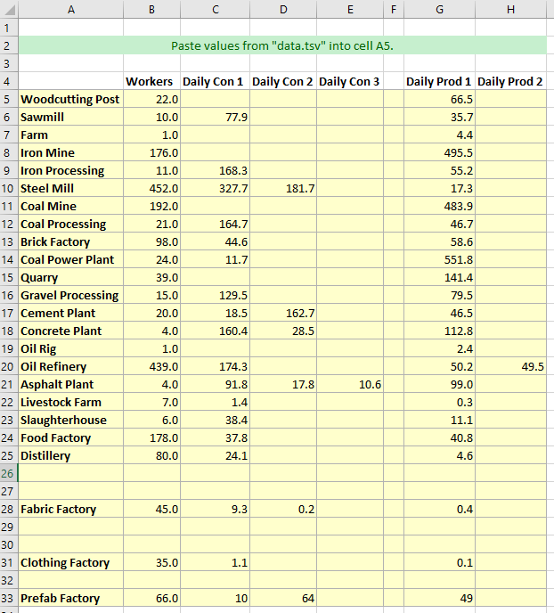
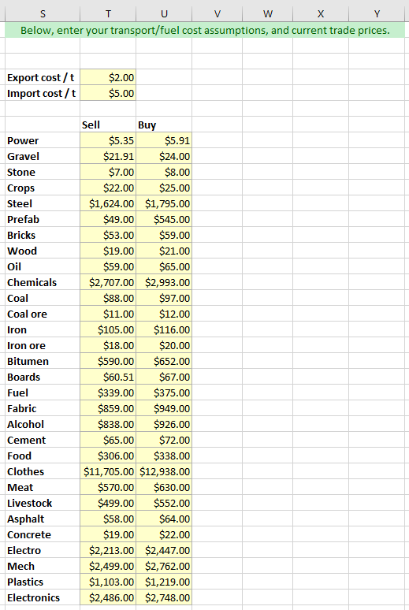
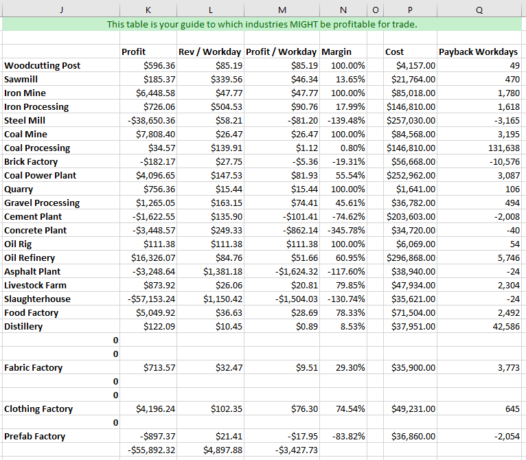

# workers-and-resources-insane-mode
Mod scripts for the game "Workers &amp; Resources: Soviet Republic". Makes the game very difficult.

# What this mod does

The goal of this mod is to make the game much more difficult, but still "winnable" in many cases.

It modifies your game production building files for the following buildings:

1. Wood Industry
   1. Woodcutting Post
   1. Sawmill
1. Iron Industry
   1. Iron Mine
   1. Iron Processing
1. Coal Industry
   1. Coal Mine
   1. Coal Processing
1. Power Industry
   1. Coal Power Plant
1. Gravel Industry
   1. Quarry
   1. Gravel Processing
1. Construction Materials Industry
   1. Brick Factory
   1. Cement Plant
   1. Asphalt Plant
1. Advanced Construction Materials Industry
   1. Steel Mill
   1. Prefab Factory
   1. Concrete Plant
1. Oil Industry
   1. Oil Rig
   1. Oil Refinery
1. Livestock Industry
   1. Livestock Farm
   1. Slaughterhouse
1. Agriculture Industry
   1. Farm
   1. Food Factory
1. Alcohol Industry
   1. Distillery
1. Clothing Industry
   1. Fabric Factory
   1. Clothing Factory

It lowers baseline production for a few buildings I think are overpowered:

1. Coal Processing: default workers required increased from 20 to 30; daily production decreased from 120t to 75t.
1. Coal Power Plant: default workers required increased from 20 to 40; daily production decreased from 1400 MWh to 1000 MWh.
1. Oil Rig: daily production decreased from 7t to 3.5t.
1. Oil Refinery: daily production decreased from 125t oil and 75t bitumen to 100t oil and 60t bitumen.
1. Clothing Factory: daily production decreased from 1.2t to 0.8t.

Then, it randomly adjusts the productivity and size of each industry by a configurable amount. The adjustments use a normal distribution with a mean (MEAN_PRODUCTIVITY_MULTIPLIER below) and a deviation (INDUSTRY_DEVIATION) below. Using the default values of 0.8 and 0.3, this means most industries will be adjusted to between 50% and 110% of the baseline values.

Then, it randomly adjusts the size (workers required), productivity, and cost of each building by a configurable amount. The productivity and size value for the given industry is the baseline, and then is randomized by the BUILDING_DEVIATION value below. So if wood had received a 90% productivity and 60% size value, using the default BUILDING_DEVIATION of 0.15, both the Woodcutting Post and Sawmill would be expected to be between 75%-110% productive per worker, and have a size of 45%-75%. The building cost is also adjusted using BUILDING_DEVIATION, but uses industry productivity multiplied by size to determine the expected value. So a very productive, large factory of 150% worker productivity and 150% size would generally cost about 225% of its baseline value.

Since these are randomized per step, the end result is a unique set of economics every game. The ratios of production, and capital costs will vary wildly every time you play. **Some scenarios will be simply unwinnable when using the default values**.

If you want a milder experience, use lower numbers when generating your nation.

# How to use

1. Download "economics.xlsx" (your spreadsheet for planning) and "dist/workersandresources.jar" (the Java file that does the modding).
2. Make a backup copy of your "buildings_types" directory from Workers & Resources: Soviet Republic into a safe place. The "buildings_types" directory is found at \[STEAM_DIRECTORY\]\steamapps\common\SovietRepublic\media_soviet\buildings_types
3. Make a working copy of your "buildings_types" directory from Workers & Resources: Soviet Republic into a different place. (IMPORTANT! DO NOT USE MODDING SCRIPTS DIRECTLY ON YOUR GAME DIRECTORY, that's always a bad idea.)
4. Run the script using Java. The usage is

    java -classpath workersandresources.jar com.jk.workersandresources.GameScenario WORKING_DIRECTORY MEAN_PRODUCTIVITY_MULTIPLIER INDUSTRY_DEVIATION BUILDING_DEVIATION
  
Where:
  
**WORKING_DIRECTORY** is your directory from #3 above. It is the only required parameter.
  
**MEAN_PRODUCTIVITY_MULTIPLIER** is the average productivity and size multiplier per industry. A value of 1 uses the default values. I think that's too easy, so I recommend 0.8 (that makes each industry 80% productive).

**INDUSTRY_DEVIATION** is the standard deviation of productivity per industry. So if you use MEAN_PRODUCTIVITY_MULTIPLIER of 0.8 and INDUSTRY_DEVIATION of 0.3, most industries will be between 50% (0.5) and 110% (1.1) productive.

**BUILDING_DEVIATION** is the standard deviation of productivity per building. This is applied on top of the industry productivity. So if you gave MEAN_PRODUCTIVITY_MULTIPLIER of 0.8, and INDUSTRY_DEVIATION of 0.3, an industry like wood may end up with productivity of 90% (0.9), and if you give BUILDING_DEVIATION of 0.15, the wood buildings would be expected to be between 75% (0.75) and 105% (1.05) productive.

If you don't supply values for the numbers, the defaults are 0.8, 0.3, and 0.15 (the values I like to run with).

The script will generate a bunch of logging output, and then at the end will give you a little blurb that will look like this:

    Greetings from the great nation of Tajmenistan!
    
    Our people are most productive in:
    Gravel (1.15)
    Energy (1.09)
    Agriculture (1.03)
    Livestock (0.88)
    Clothing (0.85)
    Construction Materials (0.84)
    Iron (0.74)
    Wood (0.70)
    Oil (0.68)
    Coal (0.61)
    Advanced Construction Materials (0.41)
    Alcohol (0.22)
    
    Our largest industries are:
    Energy (1.38)
    Coal (1.25)
    Alcohol (1.16)
    Gravel (1.08)
    Livestock (1.06)
    Agriculture (0.96)
    Advanced Construction Materials (0.79)
    Oil (0.76)
    Clothing (0.66)
    Iron (0.54)
    Construction Materials (0.50)
    Wood (0.20)
    
    Our people are most famous for:
    Energy (1.49)
    Gravel (1.23)
    Agriculture (0.99)
    Livestock (0.93)
    Coal (0.77)
    Clothing (0.56)
    Oil (0.52)
    Construction Materials (0.42)
    Iron (0.40)
    Advanced Construction Materials (0.32)
    Alcohol (0.25)
    Wood (0.14)
    
    Config files are in [DIRECTORY]\Tajmenistan-1559359482539 -- copy over the files in your buildings_types game directory (MAKE SURE TO BACK THEM UP FIRST!).
    Data for all the industries is in [DIRECTORY]\Tajmenistan-1559359482539\data.tsv
    
This is telling you which industries "should" be most productive, most large (number of workers), and most costly. **This data is a rough guide, it's intentionally misleading because the actual building values have been further randomized around those values.** In the above list, I would usually look at an industry like Agriculture as a potential starting point, because it will probably be reasonably productive without costing exorbitant capital costs.

5. You should now see a modified list of building files in the directory it gave you above. It will look like this:

6. Copy all of the ".ini" files from this directory into your actual game directory. **This will permanently change the game configuration for these buildings! Make sure you took a safe backup above. If you want to revert to the vanilla game, all you do is copy the .ini files from your backup back into the game directory.**

7. Fire up the game and play! I recommend playing on full hard mode, because if you don't find hard mode too easy, why would you be trying to run under insane mode?

# Planning Spreadsheet

This repo includes an Excel spreadsheet I used for designing this mod, and which you can use for planning how to build your great nation. It shows you the production values of every building that was modified, and estimates profitability of trade-based production for those buildings. Some people may prefer to play without using this "crutch".

To use the spreadsheet, open economics.xlsx in Excel and make sure it's open to the "Custom" tab.

Using a good text editor (not Notepad), copy the values that the script spit out into "data.tsv". Paste them into cell A5 in the spreadsheet. It should look like this:

Next, you'll need to enter actual trade values into the spreadsheet in columns T and U. The spreadsheet includes estimates for export and import costs per ton (fuel for your exports, and transport tariffs for the imports), change these based on what you think you'll be paying. That section should look like this:

You will now see the middle section updated. It looks like this:

This is the section that tells you which industries **might** be profitable based on strictly importing the products needed, and exporting the products they produce, with the transport cost assumptions above. It is usually a good idea to focus on the industries that either have a good profitability, or whose imports can be wholly created domestically (e.g. coal/iron/wood/oil/crops/gravel can all be created with zero import cost).

Keep playing! Keep the nation alive!
